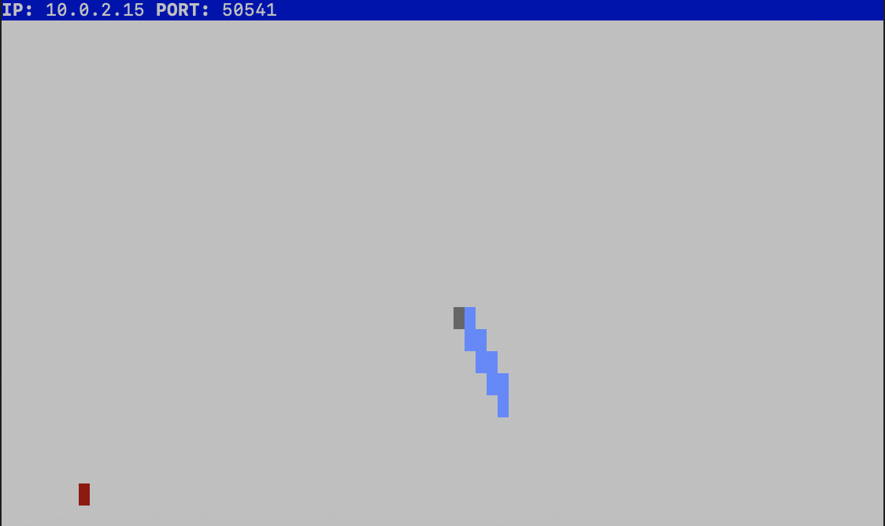
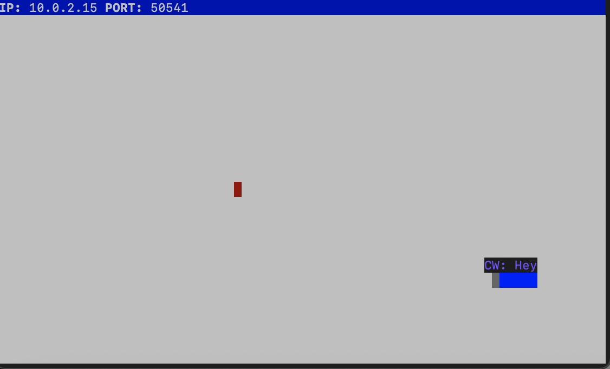

# Snake Client Project
Snake game is a very popular video game. It is a video game concept where the player maneuvers a dot and grows it by ‘eating’ pieces of food. As it moves and eats, it grows and the growing snake becomes an obstacle to smooth maneuvers. The goal is to grow it to become as big as possible without bumping into the side walls, or bumping into itself, upon which it dies.

This is simply a multiplayer take on the genre.

Before you can run this client, you will need to be running the server side which you can download and install from here. 

This is the client implementation for [snek-multiplayer](https://github.com/lighthouse-labs/snek-multiplayer). A terminal-based Snake implementation written in JavaScript (Node.js).

## Final Product

# Instructions
- Run the client using `node play.js`
- Use `W A S D` keys to navigate the snake
- Navigate snake to eat the red dots
- If the snake collides with itself or the wall, the game will end.
- Game will timeout when player idles
- Use `1 2 3 4` keys to have snake show messages
- Press `CTRL+C` to exit game